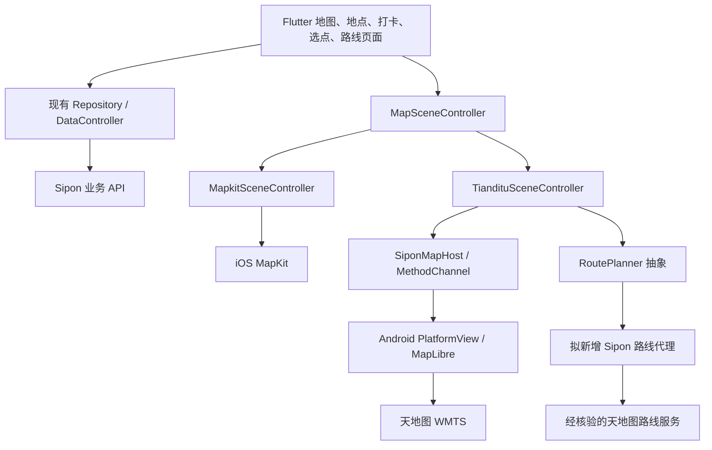

# Sipon Android 天地图适配技术方案

日期：2026-09-26  
代码基线：`82d8bb0`  
状态：技术设计，尚未实施；已完成项目代码梳理和联网调研，未使用真实天地图密钥进行服务联调。

修订说明：后端坐标已由项目负责人确认全部为 **WGS-84**。业务接口、存储及共享 Flutter 模型固定保持 WGS-84；天地图侧按 **CGCS2000** 设计适配，具体网格和服务接口参数仍通过能力文档核验。第 6.1 节明确双向边界和精度策略，不再把后端坐标系列为待确认项。

## 1. 技术结论

推荐 **Android 使用 MapLibre Native 渲染天地图 WMTS 底图，Flutter 复用现有地图业务、场景协议和页面，iOS 继续使用 MapKit**。

天地图承担底图与经开通核验的地理服务，MapLibre 承担相机、手势、业务标注及路线渲染。这个组合是本项目的工程选型，并非天地图官方 Flutter SDK。MapLibre 官方提供 Android 原生接入和栅格源能力，适合承接项目已有的 PlatformView + MethodChannel 架构。[Android 接入示例](https://maplibre.org/maplibre-native/android/examples/getting-started/)、[RasterSource API](https://maplibre.org/maplibre-native/android/api/-map-libre%20-native%20-android/org.maplibre.android.style.sources/-raster-source/index.html)。

第一版交付范围包括：首页地图、地点详情小地图/半屏/全屏、打卡地图、新增地点选点、路线地图、定位与外部导航。仅显示天地图底图不视为完成适配。

进入完整开发前，先用真实授权完成四项验证：瓦片与注记可用、坐标对齐、原生地图和 Flutter 面板的手势/合成正常、道路路线服务可用。账号与服务授权尚未核实时，不承诺额度、价格、最高级别或路线覆盖范围。

## 2. 当前项目地图业务与缺口

以下路径均相对项目根目录，描述来自当前代码，而非旧文档或注释中的历史实现。

| 业务/模块 | 当前实现 | Android 必须承接的行为 |
| --- | --- | --- |
| 地图入口 | `lib/features/map/widgets/sipon_map_widget.dart` 固定创建 `UiKitView` | 按平台选择视图，Android 注册自己的 PlatformView |
| 场景工厂 | `controllers/map_scene_controller.dart` 的 `create()` 固定返回 `MapkitSceneController` | 增加 Android 场景实现，页面保持统一接口 |
| 主地图 | `pages/map_page.dart`、`controllers/map_data_controller.dart` | 城市切换、视野取数、搜索/筛选、点选、面板联动与定位聚焦 |
| 地点地图 | `widgets/venue_mini_map.dart`、`pages/venue_map_half_page.dart`、`pages/venue_fullscreen_map_page.dart` | 单点聚焦、小地图点击跳转、半屏/全屏切换和多实例隔离 |
| 打卡 | `lib/features/reviews/pages/check_in_page.dart` | 用实际定位查询附近酒吧，注册并显示动态生成的红色图钉 |
| 新增地点 | `pages/add_venue_page.dart` | 地图停稳后读取中心经纬度并填写表单；地图未就绪不能提交 |
| 酒鬼路线 | `lib/features/routes/pages/route_detail_map_page.dart` | 站点按顺序编号、补齐缺失坐标、相邻站点逐段道路规划、完整路线取景 |
| 主题 | `models/map_display_options.dart` 与 `setAppearance` | `standard/muted/satellite` 三档的可用性映射，浅/深主题下标注可读 |
| 定位 | `lib/shared/services/sipon_city_controller.dart` 使用 `geolocator` | 权限、服务关闭、超时、无 GMS 设备；保留实际定位坐标 |
| 外部导航 | `platform/external_map_launcher.dart` | Android 地图 App 探测、平台专属 URI、坐标参数与未安装反馈 |

表中未展开目录的文件均位于 `lib/features/map/`。

### 2.1 可直接复用的业务机制

- `SiponMapHost` 已抽象命令调用和事件订阅；`ChannelMapHost` 可复用，`SiponEventSink` 会缓存监听绑定前的事件。
- `MapSceneFrame` 表达全量圆点、标签、选中点；Dart 通过帧指纹避免重复下发。标注还包含评分、路线序号和图标类别，不能仅迁移经纬度。
- 地图数据来自 Sipon `/api/bars/map`，附近酒吧来自 `/api/bars/nearby`，详情与路线仍由 Sipon 后端提供。天地图 POI 不具备业务酒吧 ID，不能替换这些接口。
- 停稳去抖为 **220 ms**；视野预取参数为 **0.2**；缩放差达到 **0.35** 或移出已加载范围触发重新取数。保留请求去重和旧响应失效机制。
- 标签按业务 zoom 抽样：`<7:24`、`<10:48`、`<12:80`、`<14:120`、`<16:180`、其余 `260`。圆点保留全量，不能一起抽样。
- `SiponDataRepository.fetchMapBars()` 当前会过滤 `cluster=true` 的条目；服务端聚合契约仍有 TODO。迁移不默认开启 MapLibre 聚合，先记录各级别真实响应，避免聚合 ID 被作为酒吧 ID 打开详情。

### 2.2 必须纠正的假设

1. Android `MainActivity.kt` 目前只见贴纸抠图通道，没有地图工厂；替换 URL 无法让现有 `UiKitView` 在 Android 工作。
2. `external_map_launcher.dart` 无条件加入 Apple 地图，高德使用 `iosamap`。这些都是实际的平台适配缺口。
3. `encodeRoutePoints` 注释仍提到先直连，但 Swift 实际代码逐段调用 `MKDirections`，`transportType = .automobile`，失败返回 `false`。应以道路规划行为为迁移目标，不能画直线后返回成功。
4. 当前定位以低精度、3 秒超时获取位置，再按本地城市中心表计算最近城市；不是通过天地图逆地理编码识别城市。打卡依赖实际位置，不能将城市中心冒充用户位置。
5. 后端全部坐标已确认是 WGS-84；天地图侧使用 CGCS2000。原生引擎不会因为换了瓦片 URL 就自动处理这两个基准的差异，展示与回传必须经过第 6.1 节的同一适配策略。本地硬编码城市中心、设备定位等非后端输入仍需验证其来源。
6. Android 现有 `minSdk=24`、Java/Kotlin JVM 17，compile/target SDK 跟随 Flutter；已有网络与粗/精定位权限，`usesCleartextTraffic=true`，发布包暂用 debug 签名。接入依赖必须在这一实际构建环境验证。

## 3. 联网调研与选型

### 3.1 候选路线

| 方案 | 与当前项目的匹配度 | 主要成本/限制 | 决策 |
| --- | --- | --- | --- |
| 天地图原生 Android SDK + 自建桥接 | 若现行 SDK 可用，可接入已有原生协议 | 本次未核实有效的当前 SDK 发布版本、下载包及维护状态，不能直接给出可信 Maven 坐标 | 暂不作为实施主线；拿到官方现行包后可复评 |
| MapLibre Native Android + 天地图 WMTS | 高；原生视图、多图层、相机、命中查询可以承接现有协议 | 需要 Kotlin 桥接、生命周期和样式恢复；增加原生库体积 | **推荐** |
| Flutter 瓦片组件 + 天地图 WMTS | 可实现二维地图，业务 UI 统一在 Flutter | 需要另做宿主、标注布局、视野/相机及面板手势实现，现有原生协议复用较少 | PoC 证明原生合成不可接受时的备选，另行验证组件版本 |
| WebView + 天地图 JavaScript API | 已有 `webview_flutter` 依赖，原型接入方便 | JS 桥接、域名/Key 授权、多实例、文字标注及复杂手势还需验证 | 仅作为备选，不默认纳入首版 |

天地图省级站点公开文档给出了 WMTS 图层、注记及 3857/4326 网格的接入模型，支持采用标准瓦片服务的技术方向；它并不能证明国家节点当前授权、限额及所有图层参数。[天地图黑龙江公开 WMTS 接入文档](https://heilongjiang.tianditu.gov.cn/iportal/iClient/forJavaScript/en/docs/openlayers/ol.source.Tianditu.html)。

### 3.2 资料可信度和未决信息

本次能读取 MapLibre、Flutter、Android、`geolocator`、`url_launcher` 官方/维护者文档。天地图国家站地图服务、驾车规划等页面直接访问多次超时；搜索可见部分官方服务文档索引，但没有真实 Key 进行响应验证。

因此，下文 WMTS 请求为 **待 GetCapabilities 和真实 Key 验证的接入模板**；路线 API 地址、格式、策略、额度和 Key 类型列为接入前置项。未能访问文档不等于服务下线，也不能据此宣布原生 SDK 停更。第三方博客、封装包的能力描述不作为发布依据。

## 4. 目标架构与协议



页面和 Repository 不直接访问 MapLibre。新增 `TiandituSceneController` 继承 `MapSceneController`；Android 路线请求建议在 Dart 的 `RoutePlanner` 内调用后端代理，得到标准化分段坐标后通过新命令交给原生绘制。图中代理与该抽象均为拟新增能力，仓库尚无对应实现。

### 4.1 兼容策略

- iOS 保留 `sipon/mapkit`、`sipon/mapkit_<viewId>`，避免无必要地同步修改 Swift。
- Android 新增 `sipon/tianditu`、`sipon/tianditu_<viewId>`，每个视图独立宿主、状态和销毁过程。共享常量改为按引擎选择，不做全局字符串替换。
- 保留既有命令载荷；Android 增加 `setRouteGeometry` 与 `onMapError`。现有 `drawRoute` 保持 iOS 行为，Android 的 `planRoute()` 由新控制器编排后端请求和原生绘制。
- `MapSceneController.create()` 与 `SiponMapWidget` 使用同一个平台/引擎选择器，并可在测试中注入；桌面和 Web 返回明确的不支持态，不能误建 `UiKitView`。

| 现有命令/事件 | Android 语义 |
| --- | --- |
| `setup` / `onMapReady` | 创建地图、载入初始 style、建业务 source/layer 后才报 ready；不把视图创建等同于可绘制 |
| `registerAssets` | 继续接收 `Uint8List`；Kotlin 解码 `ByteArray`，按类别缓存，避免原生解析中文/空格 Flutter 资源路径 |
| `renderFrame` | 缓存最新帧，按稳定 ID/内容更新业务 source 和图片；保留 selected、rating、sequence |
| `readViewport` / `onViewportSettled` | 返回合法的 west/south/east/north 与归一化业务 zoom；原生发 camera idle，Dart 保留 220 ms 去抖 |
| `focusOn` / `flyToCity` | 经纬度、zoom、bearing、pitch、duration 和底部遮挡统一换算 |
| `applyStage` | 支持只更新 padding，也支持指定 focus；目标点保持在面板上方可见区域 |
| `setGestures` | 平移/缩放/旋转可用，俯仰关闭；地图以二维展示 |
| `setStyle` / `onStyleLoaded` | 用样式版本号串行处理，完成后恢复图片、业务图层、最新帧、路线、选中态和主题 |
| `setAppearance` | 更新业务标注与控件外观；不能自动声称栅格底图有原生夜间样式 |
| `onVenueTapped` / `onBlankTapped` | 只有真实 venueId 进入详情；一次触摸最多发一种点击事件 |
| `clearRoute` / `dispose` | 取消请求，作废旧回调；释放监听、位图与地图资源，允许重复调用 |

### 4.2 异步状态机

采用 `creating → loadingStyle → ready → disposed`，初始化错误进入 `failed`。`onMapReady` 每实例只完成一次；首个 ready 前缓存最新相机意图、外观、图片和场景帧。

当前 MapKit attach 有 5 秒等待兜底，但 Android 网络与样式加载不能直接照搬为“超时视为成功”。Android 超时要显示可重试错误，`isAttached` 保持 false。ready 表示可以承接业务绘制；瓦片是否加载成功另设底图状态，样式 JSON 加载成功不能掩盖 Key 失效或瓦片全失败。

每次切 style 递增 `styleRevision`；每次规划/清除路线递增 `routeRevision`。旧结果、旧错误及 disposed 后事件全部丢弃，pending 调用仅完成一次。保留 `SiponEventSink` 的早到事件缓存，销毁时清空。

## 5. 天地图底图、外观与授权

### 5.1 图层配置

拟使用 Web Mercator 的 `_w` 系列，配置映射如下；最终以授权服务的能力文档与真实请求为准：

| 业务样式 | 拟使用图层 | 首版表现 |
| --- | --- | --- |
| `standard` | `vec_w` 底图 + `cva_w` 中文注记 | 标准地图 |
| `satellite` | `img_w` 影像 + `cia_w` 中文注记 | 带地名的影像地图 |
| `muted` | 首版回退 `standard` | Android 工具面板隐藏不支持的暗色底图选项；历史值仍兼容 |

应用深色主题继续支持，影响 Flutter UI 和业务覆盖物。对栅格施加亮度/饱和度调整只能得到视觉近似，无法独立设计道路和文字颜色；首版不承诺与 MapKit muted 一致，待产品验证与服务使用条件核验后再决定是否开放。

`vec` 表示地图内容类型，不代表返回 MVT/PBF；本方案按 WMTS 图片接入 `RasterSource + RasterLayer`，不能当 `VectorSource` 读取。MapLibre source 需要显式配置图层才能显示。[MapLibre Source 规范](https://maplibre.org/maplibre-style-spec/sources/)。

### 5.2 请求模板与验证顺序

以下为模板，`<TDT_KEY>` 必须由受控配置注入：

```text
https://t0.tianditu.gov.cn/vec_w/wmts?SERVICE=WMTS&REQUEST=GetTile&VERSION=1.0.0&LAYER=vec&STYLE=default&TILEMATRIXSET=w&FORMAT=tiles&TILEMATRIX={z}&TILEROW={y}&TILECOL={x}&tk=<TDT_KEY>
```

1. 用授权 Key 获取每种图层的 GetCapabilities，保存不含密钥的能力摘要：图层 ID、矩阵集、矩阵标识、瓦片大小、原点、范围、最低/最高级别。
2. 核实矩阵满足 Web Mercator XYZ 网格后，才令 `{z}/{x}/{y}` 对应矩阵/列/行；不交换行列，也不无依据地反转 y。不要把 `_c` 的经纬度网格直接放进默认墨卡托 source。
3. 明确设置实际 `tileSize`（通常模板按 256 验证），四个图层各自设置能力级别，不能假设相同 maxzoom。扩大相机级别时由引擎放大已有瓦片，不请求服务不存在的级别。
4. 验证低/中/高级别、边界瓦片、空瓦片和中文注记透明叠加。记录 Content-Type、图像尺寸与错误体，HTTP 200 的非图片错误也必须识别。
5. PoC 先用单域名。需要分域时传入明确的域名模板数组，不能假设 MapLibre 支持其他组件的 `{s}` 语法；授权允许的域名集合再以官方配置为准。

### 5.3 Key 与调用边界

- 在天地图控制台核验移动端直接访问 WMTS 所需的应用类型及限制，不能照抄浏览器 Key 白名单配置。记录正式包名、签名相关限制是否适用、服务开通状态和配额。
- Android 瓦片访问 Key 按开发/生产隔离，由 CI/本机未提交配置注入；不写进文档、日志或 Git。客户端 Key 可被提取，构建注入只避免源码泄漏，不能把它当作保密措施。
- 路线服务凭据优先放后端代理，代理负责鉴权、参数限制、超时、限流和错误归一化。客户端直连仅用于授权允许的 PoC，不作为默认生产设计。
- 正常在线缓存与离线批量下载分别核验使用条款；首版不提供离线包/批量抓取。保留官方要求的来源标识、版权和审图信息，具体展示按现行服务要求执行。
- 版权控件随 BottomSheet 调整位置，小地图也要可见；不能直接沿用 iOS 对 `ornamentBottomMargin` 的忽略行为。
- 天地图相关请求全部用 HTTPS。项目已全局允许明文流量，后续应先盘点现有业务接口，再收敛网络策略，不因本方案直接关闭导致其他功能失效。

## 6. 坐标、缩放、相机与覆盖物

### 6.1 WGS-84 ↔ CGCS2000 双向适配

#### 6.1.1 固定的输入输出契约

**后端数据库、所有 Sipon API、共享 Flutter 地图模型和 MethodChannel 的业务坐标统一保持 WGS-84。** 不迁移后端存量坐标，不把从天地图取得的 CGCS2000 数值直接作为 WGS-84 写回。

新增 Android `MapCoordinateAdapter`，在 Kotlin 地图边界集中处理双向适配。它位于业务协议和 MapLibre 之间，禁止页面各自转换。用独立类型/方法区分 `Wgs84Point`、`Cgcs2000Point` 和瓦片投影坐标，接口字段使用显式 `lng/lat`，数组固定 `[lng, lat]`。

| 链路 | 处理顺序 | 对业务层保证 |
| --- | --- | --- |
| 酒吧圆点、标签、选中态、城市中心、相机目标 | WGS-84 → 地图适配器 → 天地图显示坐标 → 引擎投影 | 原始模型与 ID 不变；所有覆盖物和相机用同一策略 |
| 地图准星选点、相机中心 | 屏幕反投影 → 天地图显示坐标 → 适配器反向 → WGS-84 | 传回 Dart/表单/提交 API 的始终为 WGS-84 |
| `/api/bars/map` 视野查询 | 屏幕边界反投影 → 边界采样点反向适配 → WGS-84 包围盒 → 现有预取逻辑 | 后端 bounds 和酒吧数据处于同一基准 |
| 系统定位与 `/api/bars/nearby` | 定位入口确认/归一为 WGS-84；直接查询 Sipon，仅绘图时适配 | 不用地图侧坐标污染附近查询和距离计算 |
| 天地图道路规划 | 代理接收 WGS-84 → 转服务要求的 CGCS2000 → 调用供应商 → 路线坐标转回 WGS-84 | 路线代理返回 WGS-84；Android 绘图再走统一适配器 |
| 外部导航 | 使用业务 WGS-84 原值 → 各供应商明确的输入契约 | 不复用天地图显示坐标，也不重复纠偏 |

其中道路服务最终输入/输出基准要核验端点文档；若端点明确接受 WGS-84，则按该契约直接传入，不能因为底图是 CGCS2000 就额外转一次。

#### 6.1.2 基准转换与投影是两件事

WGS-84 与 CGCS2000 是不同的大地参考基准。选择 `_w` 墨卡托瓦片仅确定显示网格，**不会把后端 WGS-84 自动转换成 CGCS2000**；选择 `_c` 也不能消除二者的基准差异。MapLibre 按自己的经纬度/墨卡托模型绘制，不能将它视为支持任意 CRS 自动转换的 GIS 引擎。

这也不是 WGS-84 ↔ GCJ-02 的互联网地图纠偏问题，不应引入 GCJ-02/BD-09 算法来“转成 2000”。同样，仅修改 CRS 标签、替换椭球参数，或调用一次坐标库得到相同数值，都不足以证明完成了可靠的大地基准转换。

高精度转换还取决于 WGS-84 的具体实现、坐标历元、区域与有效转换参数，涉及三维过程时还需要高度信息。当前“后端全部 84”的事实已经明确，但并不意味着现有二维经纬度附带这些测地元数据。不能凭这两项经纬度编造一套全国通用七参数。

#### 6.1.3 首版策略：有精度约束的显示近似，保留严格转换路径

本项目是酒吧 POI 浏览与选点，建议先验证 `ApproximateIdentity`：在适配器边界保留两个基准的类型与方向，但显示时经纬度数值暂不改变。**这是待误差验证的工程近似，不是宣称两个基准相同，也不是已经完成高精度转换。** 不承诺全国统一的厘米级或亚米级误差。

建议将“坐标适配自身的水平误差 ≤ 2 米”作为 P0 的初始评估门槛，并单独统计地点采集误差、定位误差和底图影像配准误差；该门槛是项目设计建议，不是实测结果。取至少 3 个业务城市、每城 5 个具有可信双基准坐标的同名点验证，不能只凭肉眼对齐底图或正反转换回到原值就判定合格。缺少可信同名点时，精度结论保持未验证。

只有近似误差符合业务要求，首版才可启用此策略；选点回传也必须经过其反向路径并记录策略版本。若不符合精度要求，或新增精密采集用途，切换为 `ValidatedTransform`：采用权威的区域/历元转换参数或服务，记录适用范围、精度和版本，正反向配套实现；不能用经验固定偏移补偿整个城市。

使用 PROJ 等库时检查实际选中的 coordinate operation、适用范围和精度，严格模式禁用 ballpark 回退。坐标库存在“未知精度的近似转换”，不能仅凭 API 调用成功验收。[PROJ 对 ballpark 的定义](https://proj.org/en/stable/glossary.html)、[精度与 ALLOW_BALLPARK 配置](https://proj.org/en/stable/development/reference/functions.html)。

#### 6.1.4 MapLibre 与严格策略的实施边界

在经能力文档验证可兼容的天地图 `_w` 网格上，首版把适配器输出数值作为地图内部显示坐标交给 MapLibre，业务 GeoJSON 仅在渲染边界生成。这是显示坐标约定，不能把 CGCS2000 数值导出为标准 WGS-84 GeoJSON，或再送入其他业务服务。

严格转换若需要网络/大体积参数，不逐个 marker 发远程请求。由后端适配服务批量转换并缓存显示副本，原始数据库与对外业务 API 仍为 WGS-84；服务须同时支持选点与 bounds 的反向转换，并与路线代理使用同一策略版本。若目标瓦片投影无法按 MapLibre 网格准确对齐，还需重投影瓦片或改用支持目标 CRS 的引擎，不能只变换点位后宣称完成。

首次加载、切底图、主题重放、路线恢复均从缓存的 WGS-84 原始数据生成显示坐标，避免累积转换。转换不可用时阻止精确选点提交并提示重试，不能把未转换坐标伪装成 WGS-84 保存。

### 6.2 业务 zoom 与引擎 zoom

iOS `SiponMapGeometry.tileSize=256`，业务默认 zoom 为 `15.05`，城市 `11.8`，聚焦 `15.4`。不能直接把 MapLibre 相机数值当成相同业务尺度；source 瓦片尺寸与引擎相机世界像素基准是两个概念。

PoC 固定纬度、bearing=0、pitch=0 和相同逻辑视口宽度，用实际 bounds 标定 `CameraZoomAdapter`。若所选版本按 512 世界基准计算，则理论初值为：

```text
256 × 2^businessZoom = 512 × 2^nativeZoom
nativeZoom = businessZoom - 1
businessZoom = nativeZoom + 1
```

这是待实测标定的推导，不直接写死为未经验证的 SDK 契约。验证多个 zoom、纬度和像素密度后冻结适配器。向后端、标签抽样和圆点半径回传业务 zoom；瓦片 z 由引擎按 source 网格选择，不额外套用相机的减一公式。

### 6.3 面板与选点

- 协议中的 padding 和点击容差统一为 Flutter 逻辑像素；Kotlin 调用要求物理像素的 API 时转换一次，不能漏乘或重复乘 density。
- `applyStage` 保持面板可见区域内的目标点位置，连续拖拽时合并到最新值；程序相机与手势停稳遵守同一视野取数判定。
- `readViewport` 返回反向适配为 WGS-84 的真实 bounds，新增可选 `centerLng/centerLat` 表示地图画面选点位置；Dart 对旧 iOS payload 回退现有 `bounds.center`。Web Mercator 下纬度边界算术平均不等于屏幕中心，新增地点应读取十字准星位置反投影并经坐标适配器回传的结果。
- 定位、详情聚焦和路线取景使用各自 padding，不共用残留状态。旋转后的 bounds 是外包围盒，不能再由其跨度估算 zoom。

### 6.4 业务图层与命中

建议固定图层顺序：底图 → 天地图注记 → 路线 → 业务圆点 → 选中光环 → 业务标签。各业务 source/layer 使用独立稳定 ID。

- 全量圆点使用 GeoJSON + CircleLayer；标签使用 SymbolLayer，首版可在 Kotlin Canvas 合成图标、名称、评分/序号为图片，避免引入未经部署的远程中文字形服务。
- 图片缓存键包含类别、文案、评分/序号、主题与密度；采用有上限的 LRU，帧变化不全量重建位图。沿用 Dart 标签抽样上限，并验证选中点始终可辨识。
- 点击只查询业务图层，优先标签/选中点，再查询圆点；采用逻辑像素容差。无 venueId 的展示点不打开详情，路线合成 ID 由路线页面处理，不能送进酒吧详情 API。
- 切底图后重放已缓存资源和业务状态；appearance 更新同步使图片缓存失效，避免深色主题下留下浅色胶囊。

## 7. 路线、定位与外部导航

### 7.1 道路路线

Android 要对齐现有“相邻站点按顺序逐段驾车规划”的行为。天地图是否提供满足要求的现行驾车端点、策略、返回结构与坐标基准，必须通过官方账号与服务联调确认；本方案不把搜索到的第三方参数当成已验证协议。

拟新增后端接口 `POST /api/map/routes/plan`，这是设计建议，不是当前已有接口。请求包含 `requestId`、`crs=WGS84`、`mode=driving`、有序站点；成功响应固定为 `crs=WGS84` 的分段坐标数组及可选距离/耗时。代理按第 6.1 节处理供应商侧的双向适配，客户端不直接解析供应商 XML/JSON。对站点数、请求时长和重复请求设限。

`TiandituSceneController.planRoute()` 流程：校验全部站点 → 递增 revision 并取消旧任务 → 请求代理 → 核验每段结果 → `setRouteGeometry` 绘制 → 按面板留白 fit bounds → 返回 true。`setRouteGeometry` 载荷建议为 `{revision, legs: [{coordinates: [[lng, lat], ...]}]}`，原生仅负责绘制并确认成功。

缺少坐标时保留页面现有错误语义，不跳过中间站点而连接其前后地点。任一路段失败，清除旧路线并返回 false，保留站点及重试提示；默认不以直线代替道路路线。切 style 重放几何，不重新请求路线；离页/清除/换路线必须作废在途结果。

若天地图道路服务未通过验证，主地图 PoC 可继续，但“路线业务完整适配”不能验收。需要另行确定可用道路服务后完成同一 `RoutePlanner` 接口。

### 7.2 定位

继续使用 `geolocator`，不为显示底图额外引入定位 SDK。该包 Android 实现支持 FusedLocationProvider 和 LocationManager 路径，需结合无 GMS 真机验证，并可通过 Android 专属设置选择 LocationManager。[维护者文档](https://pub.dev/packages/geolocator)。

城市推荐可保留当前低精度策略；打卡附近查询应单独设定精度、超时和位置新鲜度，避免 3 秒城市定位策略在室内冷启动时频繁失败。处理粗略授权、拒绝、永久拒绝、服务关闭、超时与无网络。展示地图不依赖定位授权；打卡无实际位置时显示现有错误，不自动用城市中心查询附近酒吧。

### 7.3 外部导航

Android 不展示 Apple 地图；高德采用其 Android URI 分支，百度/腾讯也分别核验目的地、出行方式和坐标参数。具体 scheme 与参数在实施时依据各供应商现行文档和装机测试冻结，本次未完整核验这些供应商的全部 URI 参数。

在 Android manifest 的现有 `<queries>` 中补充实际用于 `canLaunchUrl` 的地图 VIEW intent，不申请宽泛的应用列表权限。Android 11+ 的包可见性会影响探测结果，已有 `PROCESS_TEXT` 配置并不足够。[url_launcher 配置文档](https://pub.dev/packages/url_launcher)。

每种 App 测试已安装/未安装、含空格及中文的名称、目的地对齐和坐标转换。不要复制现有 `coord_type` 注释作为跨平台保证；未安装时显示提示，不能用打开浏览器就声称打开了导航 App。

## 8. Android 原生集成与错误恢复

新增 `SiponTiandituFactory`、`SiponTiandituView` 等 Kotlin 类，在 `MainActivity.configureFlutterEngine()` 注册工厂，同时保留现有抠图通道。

依赖采用官方 Maven 坐标 `org.maplibre.gl:android-sdk:<经验证版本>`，从 Maven Central 获取并固定版本。本次读取的 API 页面显示 13.6.1，但文档版本不等于项目已验证依赖版本；PoC 检查 minSdk、AGP/Kotlin/JDK、ABI 和实际 Flutter 工具链后锁定，不使用 `+`。[官方接入说明](https://maplibre.org/maplibre-native/android/examples/getting-started/)。

- 初始采用 `PlatformViewLink + AndroidViewSurface` 验证原生地图合成，再按性能结果选择具体模式。Flutter 官方指出不同 PlatformView 模式在原生保真和 Flutter 性能间存在取舍，不能只靠 AndroidView 默认配置推定兼容。[Flutter Platform Views](https://docs.flutter.dev/platform-integration/android/platform-views)。
- 验证 MapView 的实际渲染视图与合成模式组合：地图上叠加搜索框、圆角卡片、BottomSheet、键盘和路由过渡时不能黑屏、穿透或丢手势。
- 地图触摸区域可参考现有 eager 策略，但需保证面板区域优先命中 Flutter 控件；小地图在滚动容器中的点击/滑动按原页面策略处理，不能给所有入口统一抢占手势。
- 为每个实例转发 MapView 创建、start/resume/pause/stop、低内存、保存状态与 destroy，解绑 Activity/地图监听；页面退出与 Activity 销毁必须幂等，多实例不能相互销毁。[MapView 生命周期示例](https://maplibre.org/maplibre-native/android/examples/getting-started/)。
- 包含原生 `.so` 的依赖要验证目标 ABI 与 16 KB 内存页设备的安装运行，检查最终 release APK/AAB，不能只验证 debug 模拟器。[Android 原生库兼容说明](https://developer.android.com/guide/practices/page-sizes)。

错误至少区分配置缺失/鉴权失败、瓦片加载失败、样式初始化失败、业务 API 失败、定位失败、路线失败。底图失败与 `MapDataStatus` 分开显示，不把瓦片故障误报为“当前视野暂无酒吧”。瞬时网络错误有限退避重试；鉴权失败不对每张瓦片无限重试。

新增按 Android 控制的地图开关；关闭时展示可重试占位及可用业务列表。Android 目前没有可工作的旧地图实现，因此回滚目标是禁用地图能力或回退前一已验证 Android 版本，不能回滚到 MapKit。

## 9. 文件级实施清单

| 文件/目录 | 拟修改内容 |
| --- | --- |
| `lib/features/map/widgets/sipon_map_widget.dart` | 平台视图分发、统一宿主创建、多实例和加载失败 UI |
| `lib/features/map/controllers/map_scene_controller.dart` | 平台工厂、可注入引擎选择；保持页面 API |
| `lib/features/map/controllers/tianditu_scene_controller.dart`（新增） | ready/style 状态机、帧恢复、路线编排、错误上报 |
| `lib/features/map/platform/sipon_map_protocol.dart` | 平台通道选择、可选中心坐标、Android 路线几何和错误协议 |
| `lib/features/map/platform/sipon_map_host.dart` | 优先保持现有抽象；验证解绑/销毁竞态 |
| `lib/features/map/models/map_viewport.dart` | 可选精确选点中心，旧 payload 兼容；保留预取策略 |
| `lib/features/map/models/map_display_options.dart`、`widgets/map_tools_sheet.dart` | 引擎能力对应的样式选项及不支持值回退 |
| `lib/features/map/data/route_planner.dart`（新增） | 路线供应商隔离、代理调用、分段结果校验 |
| `lib/features/map/platform/external_map_launcher.dart` | 平台化 App 列表与 URI、坐标与错误反馈 |
| `lib/shared/services/sipon_city_controller.dart` | 按定位用途选择策略，Android provider 与权限处理 |
| `lib/features/map/pages/add_venue_page.dart` | 使用真实准星中心，提交坐标契约明确 |
| `android/app/src/main/kotlin/com/example/sipon/MainActivity.kt` | 注册地图工厂并接入生命周期管理 |
| 同目录 `map/`（新增） | Factory/View/Channel、底图配置、CameraZoomAdapter、覆盖物与位图缓存 |
| 同目录 `map/MapCoordinateAdapter.kt`（新增） | WGS-84/CGCS2000 双向适配、类型与策略版本；覆盖物、相机、选点、bounds 共用 |
| `android/app/build.gradle.kts` | 固定 MapLibre 版本、Key 构建注入、release 兼容验证 |
| `android/app/src/main/AndroidManifest.xml` | 地图 App queries，核查权限与网络策略 |
| Sipon 后端（本仓库外） | 保持 WGS-84 契约；路线代理内的供应商坐标适配，严格模式所需的批量转换能力、服务密钥与调用治理 |

如需拆分文件，保持以上职责边界；不在主 Activity 内堆叠业务渲染代码。Flutter 无需为了本方案直接增加地图插件依赖。

## 10. 实施阶段与验收

以下为具备 Flutter/Kotlin 能力、天地图授权可用前提下的初步人日估算；后端服务开通等待、签名与发布流程另计。

| 阶段 | 预估 | 交付与退出条件 |
| --- | --- | --- |
| P0：授权与 PoC | 2–3 人日 | 实际 Key 双底图/注记、坐标样本、zoom 标定、面板合成及道路服务验证记录；冻结 SDK 版本 |
| P1：基础桥接 | 3–4 人日 | Android 工厂、协议、初始化错误、相机/视野、生命周期、多实例跑通 |
| P2：业务对齐 | 4–6 人日 | 全部标注、选中、评分/序号、主题、详情地图、打卡和新增地点通过 |
| P3：路线与导航 | 3–5 人日 | 后端代理联调、分段路线、取消、fit bounds、外部 App 导航与定位完成 |
| P4：质量与灰度 | 2–3 人日 | Android 真机与 iOS 回归、release 检查、指标与开关可用 |

合计约 **14–21 人日**；这是显示近似通过验证情况下的方案估算，P0 结束后按 SDK、授权和后端改动结果修订。严格基准转换所需参数获取、测地验证及可能的瓦片重投影单独评估，不纳入该估算。

### 10.1 自动化验证

复用 `test/map_test.dart`、`test/mapkit_frame_codec_test.dart`、`test/mapkit_asset_loading_test.dart`、`test/route_map_test.dart`、`test/venue_map_navigation_test.dart`、`test/check_in_location_test.dart`、`test/location_chain_test.dart`，不能因新增 Android 破坏 iOS 默认行为。

新增有意义的测试：

- 平台选择、独立通道、初始化失败/迟到 ready、重复销毁以及 dispose 后不回调。
- style 快速连续切换后仅最新版本生效，图片/评分/序号/选中点/路线恢复完整。
- zoom 双向转换和多密度 padding；screen center 与包围盒中心区别；无效坐标拒绝。
- 采用可信双基准同名点检查适配误差；检查显示正向、选点/bounds 反向、路线代理双向的坐标契约；防止 CGCS2000 写回 WGS-84 API、重复转换和严格模式静默退为 identity。往返测试不能替代绝对精度验证。
- 代理分段成功/失败、缺中间坐标、路线取消、旧结果丢弃、原生绘制失败不得返回规划成功。
- Android 导航候选列表不含 Apple；各平台 URI 和带中文/空格名称的编码符合冻结契约。

实施后运行 `flutter analyze`、相关 Flutter 测试、Kotlin 几何/状态测试、Android release 构建；共享 Dart 变化在 macOS/Xcode 环境补做 iOS 编译与地图回归。本文仅新增方案，本次不声称这些运行验证已通过。

### 10.2 真机验收矩阵

| 维度 | 必测场景与通过标准 |
| --- | --- |
| 设备 | API 24 基线、API 30+ 可见性、当前 target 对应系统；至少一台无 GMS 国产机、一台低内存机；覆盖 16 KB 环境 |
| 业务入口 | 主地图、详情小/半/全屏、评论关联地图、打卡、新增地点、路线；入口全部能加载并操作 |
| 手势/遮挡 | 平移、捏合、旋转、面板连续拖拽、键盘弹出、返回；不能出现冻结、误点、目标被遮挡或地图盖住面板 |
| 坐标 | 多城市可信双基准样本达到第 6.1 节冻结的精度门槛；展示/选点提交/bounds/路线/导航全部遵守 WGS-84 业务契约；定位误差和影像误差另行统计 |
| 路线 | 2 点、多点、缺失站点、不可达、超时、重试、切样式、离页；不显示旧路线，不将直线当规划成功 |
| 失败恢复 | Key 缺失/失效、断网、弱网、注记失败、业务接口失败、拒绝定位；错误分类准确，恢复后可继续使用 |
| 生命周期 | 前后台、锁屏、旋转、多页叠加、连续进出 30 次；无崩溃、串台、持续内存增长或销毁后回调 |
| 外观 | 浅/深主题、标准/影像、字体和不同密度；标签可读、版权不被面板遮挡 |

### 10.3 性能与上线门槛

先在指定基准机和固定网络建立基线，建议目标：地图容器可交互 P95 ≤ 2 秒，正常网络首屏底图可见 P95 ≤ 3 秒，常见交互帧耗时 P95 ≤ 33 ms。它们是待 P0 校准的验收目标，不是供应商性能承诺。

压力样本取“接口真实最大圆点量 + 各 zoom 最大标签数”，另做 1,000/5,000 圆点探索。记录冷/热启动、瓦片数量/失败率、业务帧耗时、内存峰值与退出后回落、APK/AAB 增量；不为追求指标删减应展示圆点。

上线门槛：P0 四项验证通过；全部业务入口完成；路线达到现有道路规划语义；来源标识与授权配置确认；iOS 回归通过；生产 Key、包名/签名、错误监控和关闭开关可用。

## 11. 实施前待核验清单

- [ ] 天地图账号的应用类型、WMTS/路线授权、配额与使用条件已记录。
- [ ] 四个瓦片图层的实际能力、HTTPS、Key 失效响应和注记叠加已验证。
- [x] 后端全部坐标为 WGS-84（项目负责人已确认），共享业务模型和 API 保持该契约。
- [ ] 天地图 CGCS2000 适配策略及误差门槛完成验证，显示/选点/bounds/路线双向链路通过；非后端输入来源已核验。
- [ ] MapLibre 固定版本在当前 Flutter/Gradle/JDK、minSdk 24 和目标 ABI 上构建运行通过。
- [ ] 道路服务的现行端点、返回格式、坐标和错误语义已冻结，后端代理负责人明确。
- [ ] Android 暗色底图回退策略和地图版权展示位置已确认。
- [ ] 外部导航供应商参数、无 GMS 定位和正式包身份已真机核验。

## 12. 参考资料与访问说明

查阅日期均为 2026-09-26；以下不含密钥。正文按具体论点引用，便于实施时复核。

| 来源 | 本次状态与用途 |
| --- | --- |
| [天地图地图服务](https://lbs.tianditu.gov.cn/server/MapService.html) | 直接访问超时；实施时核验国家节点图层、矩阵及服务说明 |
| [天地图 Web 服务入口](https://lbs.tianditu.gov.cn/server/guide.html) | 直接访问超时；实施时核验现行服务目录 |
| [天地图驾车规划文档入口](https://lbs.tianditu.gov.cn/server/drive.html) | 直接访问超时；作为待复核入口，不能视为端点已联通 |
| [天地图地名搜索](https://lbs.tianditu.gov.cn/server/search2.html) | 搜索索引可见，直接访问超时；非替换 Sipon 业务 POI 的依据 |
| [天地图黑龙江 WMTS 文档](https://heilongjiang.tianditu.gov.cn/iportal/iClient/forJavaScript/en/docs/openlayers/ol.source.Tianditu.html) | 已读取；仅用于标准接入模型参考，文档本身较旧 |
| [MapLibre Android Quickstart](https://maplibre.org/maplibre-native/android/examples/getting-started/) | 已读取；Maven 接入、MapView 与生命周期 |
| [MapLibre Android RasterSource](https://maplibre.org/maplibre-native/android/api/-map-libre%20-native%20-android/org.maplibre.android.style.sources/-raster-source/index.html) | 已读取；栅格瓦片与 tileSize 接口 |
| [MapLibre Source 规范](https://maplibre.org/maplibre-style-spec/sources/) | 已读取；栅格/GeoJSON/source 和网格设置 |
| [Flutter Android Platform Views](https://docs.flutter.dev/platform-integration/android/platform-views) | 已读取；原生视图注册与合成取舍 |
| [geolocator 维护者文档](https://pub.dev/packages/geolocator) | 已读取；Android 定位 provider 与权限配置 |
| [url_launcher 维护者文档](https://pub.dev/packages/url_launcher) | 已读取；Android queries、探测与 URI 编码 |
| [Android 16 KB 页支持](https://developer.android.com/guide/practices/page-sizes) | 已读取；原生依赖最终产物兼容检查 |
| [PROJ 转换术语](https://proj.org/en/stable/glossary.html) | 本次修订查阅；区分已知精度转换和 ballpark 近似 |
| [PROJ 操作选择 API](https://proj.org/en/stable/development/reference/functions.html) | 本次修订查阅；指定精度并禁止静默 ballpark 回退 |
